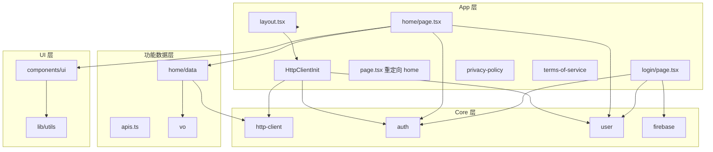

# qianting-fe 项目技术架构梳理与总结

本文档对 qianting-fe（股票量化分析前端）的技术栈、目录结构、数据流与认证流程进行梳理，供团队复用与扩展参考。

---

## 1. 项目定位与技术栈

- **项目名**: qianting-fe（Qianting · 股票量化分析）
- **功能**: 输入股票代码，获取多维量化评分报告；支持 Google 登录与登录态管理。
- **核心依赖**:
  - **框架**: Next.js 16.1.6（App Router）+ React 19.2.3
  - **构建**: TypeScript 5、React Compiler（`next.config.ts` 中 `reactCompiler: true`）
  - **HTTP**: Axios 封装的统一 [http-client](src/core/http-client/index.ts)（单例、Bearer 注入、`Result<T>` 封装）
  - **认证**: Firebase Auth（Google 登录）+ 自建后端 `/auth/login`、`/auth/me`、`/auth/logout`
  - **UI**: Tailwind CSS v4（`@theme` 在 [globals.css](src/app/globals.css)）+ shadcn 风格组件（Radix UI、class-variance-authority、tailwind-merge、clsx）
  - **字体**: next/font — Instrument Serif、JetBrains Mono、Plus Jakarta Sans（在 [layout.tsx](src/app/layout.tsx) 注入 CSS 变量）

路径别名：`@/*` → `./src/*`（[tsconfig.json](tsconfig.json)）。

---

## 2. 目录与分层结构

| 目录/文件 | 职责 |
|-----------|------|
| **src/app/** | Next App Router：根 layout、全局 HttpClientInit、路由页（home、login、privacy-policy、terms-of-service）；根 `page.tsx` 仅 re-export `home/page` |
| **src/core/** | 与框架解耦的核心能力：HTTP 客户端、认证 API/存储、用户单例与 React 订阅、Firebase 封装 |
| **src/app/home/data/** | Home 模块的数据层：接口封装（apis.ts）、VO 类型（vo/*.vo.ts） |
| **src/components/ui/** | 通用 UI 组件（Button、Card、Badge、Skeleton、Progress、Input、Alert 等），基于 Radix + CVA + `cn()` |
| **src/lib/** | 工具函数（如 `cn` 合并 className）、通用类型 |

---

## 3. 核心数据流与认证流程

### 3.1 HTTP 客户端初始化（应用启动）

- [HttpClientInit.tsx](src/app/HttpClientInit.tsx) 在根 layout 中挂载，仅在客户端执行：
  1. 调用 `getUserManager()` 确保用户单例存在。
  2. 从 `sessionStorage` 用 `getStoredToken()` / `getStoredUser()` 恢复 token 与 name/avatar，若有则 `getUserManager().setUser(...)`。
  3. `initHttpClient({ getToken: () => getUserManager().getToken() })`，之后所有请求通过拦截器自动带 `Authorization: Bearer <token>`。
- 设计要点：不直接依赖 React 状态，token 由 UserManager 单例 + sessionStorage 提供，保证刷新后仍能带 token。

### 3.2 认证与用户状态

- **Firebase**: [firebase.ts](src/core/firebase.ts) 提供 `signInWithGoogle()`、`getIdToken(user)`，仅浏览器且配置了 `NEXT_PUBLIC_FIREBASE_*` 时可用。
- **Auth API**: [core/auth/api.ts](src/core/auth/api.ts) 使用 http-client 调用后端：
  - `authLogin(idToken)` → POST `/auth/login`，换取 `access_token` 与用户信息；
  - `authMe()` → GET `/auth/me`（带 token）校验/拉取当前用户；
  - `authLogout()` → POST `/auth/logout`（带 token）使 token 失效。
- **持久化**: [core/auth/storage.ts](src/core/auth/storage.ts) 使用 sessionStorage 存 `access_token`、`user_name`、`user_avatar`；提供 `saveAuthToStorage` / `clearAuthFromStorage` / `getStoredToken` / `getStoredUser`。
- **用户单例**: [core/user/index.ts](src/core/user/index.ts) 的 `UserManager` 维护内存中的 `UserVo`（token、name、avatar），提供 `login`/`logout`、`onLogin`/`onLogout` 订阅；[useUser](src/core/user/useUser.ts) 通过订阅将 UserManager 状态同步到 React，供导航栏等使用。
- **登录流程**（[login/page.tsx](src/app/login/page.tsx)）：Google 弹窗 → Firebase `getIdToken` → `authLogin(idToken)` → 存 sessionStorage + `getUserManager().login(...)` → `router.replace(callbackUrl)`。

### 3.3 业务请求与类型

- Home 模块通过 [home/data/apis.ts](src/app/home/data/apis.ts) 调用 `get<QuantDataVo>(url)`，返回 `Result<QuantDataVo>`；VO 定义在 [home/data/vo/](src/app/home/data/vo/)（如 [quant-data.vo.ts](src/app/home/data/vo/quant-data.vo.ts)）。
- [http-client](src/core/http-client/index.ts) 约定：后端 body 为 `{ code, message?, data? }`，成功时 `code === 0`，`get/post` 等返回 `Result<T>`（成功时 `data` 为 body.data 或 body 本身），不抛错，由调用方根据 `ok: boolean` 处理。

---

## 4. UI 与样式体系

- **主题**: [globals.css](src/app/globals.css) 使用 Tailwind v4 `@theme` 与 `:root` 定义字体、颜色、阴影、圆角、动画等；部分类名（如 `.card`、`.badge`、`.search-wrapper`）与 home 页内联样式并存。
- **组件**: [components/ui](src/components/ui) 为 shadcn 风格（CVA 变体 + Radix 插槽 + `cn()`），home 页大量使用 Card、Badge、Skeleton、Progress 等。
- **字体**: 在 layout 中通过 next/font 注入 `--font-instrument-serif`、`--font-jetbrains-mono`、`--font-plus-jakarta-sans`，在 globals 中映射到 `--font-sans` / `--font-mono` / `--font-serif`。

---

## 5. 路由与入口

- `/` → [app/page.tsx](src/app/page.tsx) → 实际渲染 [app/home/page.tsx](src/app/home/page.tsx)（首页量化报告）。
- `/login` → [app/login/page.tsx](src/app/login/page.tsx)（Google 登录，支持 `callbackUrl`）。
- `/privacy-policy`、`/terms-of-service` → 静态策略/条款页。

---

## 6. 架构要点小结

- **分层**: App（路由、页面）→ Core（HTTP、Auth、User、Firebase）→ 功能 data（apis + vo）→ UI（components + lib）。
- **认证**: Firebase Google 登录 + 自建后端 token；sessionStorage 持久化；UserManager 单例 + 订阅，HttpClient 初始化时从 storage 恢复并注入 getToken。
- **请求**: 统一 http-client 单例、Axios 拦截器挂 Bearer、Result 封装、按 code 判断成功/失败。
- **类型**: 接口数据以 VO 形式集中在各模块的 `data/vo`，与 apis 对应，便于维护和类型安全。

如需扩展，可在同层按模块增加（如新 feature 的 `data/apis + vo`），或复用 core 的 http、auth、user 能力。
