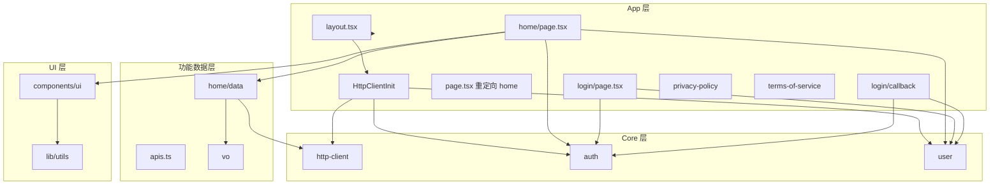

# qianting-fe 项目技术架构梳理与总结

本文档对 qianting-fe（股票量化分析前端）的技术栈、目录结构、数据流与认证流程进行梳理，供团队复用与扩展参考。

---

## 1. 项目定位与技术栈

- **项目名**: qianting-fe（Qianting · 股票量化分析）
- **功能**: 输入股票代码，获取多维量化评分报告；支持 Google 登录与登录态管理。
- **核心依赖**:
  - **框架**: Next.js 16.1.6（App Router）+ React 19.2.3
  - **构建**: TypeScript 5、React Compiler（`next.config.ts` 中 `reactCompiler: true`）
  - **HTTP**: Axios 封装的统一 [http-client](src/core/http-client/index.ts)（单例、Bearer 注入、`Result<T>`；请求级 `baseURL` 可打到认证 host）
  - **认证**: [harbor-services](https://harbor.qianting.xyz) Google OAuth + JWT 双令牌（access / refresh）
  - **UI**: Tailwind CSS v4（`@theme` 在 [globals.css](src/app/globals.css)）+ shadcn 风格组件（Radix UI、class-variance-authority、tailwind-merge、clsx）
  - **字体**: next/font — Instrument Serif、JetBrains Mono、Plus Jakarta Sans（在 [layout.tsx](src/app/layout.tsx) 注入 CSS 变量）

路径别名：`@/*` → `./src/*`（[tsconfig.json](tsconfig.json)）。

---

## 2. 目录与分层结构

| 目录/文件 | 职责 |
|-----------|------|
| **src/app/** | Next App Router：根 layout、全局 HttpClientInit、路由页（home、login、login/callback、privacy-policy、terms-of-service） |
| **src/core/** | 与框架解耦的核心能力：HTTP 客户端、认证 API/存储、用户单例与 React 订阅 |
| **src/app/home/data/** | Home 模块的数据层：接口封装（apis.ts）、VO 类型（vo/*.vo.ts） |
| **src/components/ui/** | 通用 UI 组件（Button、Card、Badge、Skeleton、Progress、Input、Alert 等），基于 Radix + CVA + `cn()` |
| **src/lib/** | 工具函数（如 `cn` 合并 className）、通用类型 |

---

## 3. 核心数据流与认证流程

### 3.1 HTTP 客户端初始化（应用启动）

- [HttpClientInit.tsx](src/app/HttpClientInit.tsx) 在根 layout 中挂载，仅在客户端执行：
  1. 调用 `getUserManager()` 确保用户单例存在。
  2. 从 **localStorage** 用 `getStoredToken()` / `getStoredUser()` 恢复 token 与 name/avatar，若有则 `getUserManager().setUser(...)`。
  3. `initHttpClient({ getToken: () => getUserManager().getToken() })`，之后业务请求自动带 `Authorization: Bearer <token>`。
  4. 有 token 时调用 harbor `authMe()`；若失效且存在 refresh，则 `authRefresh` 后再 me。
- 设计要点：token 由 UserManager + localStorage 提供；认证与业务可不同 host（请求级 `baseURL`）。

### 3.2 认证与用户状态

- **Auth API**: [core/auth/api.ts](src/core/auth/api.ts) 指向 harbor-services：
  - `oauthAuthorize` → GET `/api/v1/auth/oauth/google/authorize`
  - `oauthCallback` → POST `/api/v1/auth/oauth/google/callback`
  - `authRefresh` / `authLogout` / `authMe`
- **持久化**: [core/auth/storage.ts](src/core/auth/storage.ts) 使用 localStorage 存 `access_token`、`refresh_token`、`user_name`、`user_avatar`。
- **用户单例**: [core/user](src/core/user/index.ts) 的 `UserManager` + [useUser](src/core/user/useUser.ts)。
- **登录流程**：`/login` 拉 `authorize_url` 整页跳转 → Google → `/login/callback`（`code` + `state`）换 token → 存 localStorage + UserManager → 回跳业务页。

### 3.3 业务请求与类型

- Home 模块通过 [home/data/apis.ts](src/app/home/data/apis.ts) 调用 `get<QuantDataVo>(url)`，返回 `Result<QuantDataVo>`；VO 定义在 [home/data/vo/](src/app/home/data/vo/)。
- [http-client](src/core/http-client/index.ts) 约定：后端 body 为 `{ code, message?, data? }`，成功时 `code === 0`，返回 `Result<T>`，由调用方根据 `ok` 处理。

---

## 4. UI 与样式体系

- **主题**: [globals.css](src/app/globals.css) 使用 Tailwind v4 `@theme` 与 `:root`。
- **组件**: [components/ui](src/components/ui) 为 shadcn 风格。
- **字体**: layout 注入 CSS 变量，globals 映射到 `--font-sans` / `--font-mono` / `--font-serif`。

---

## 5. 路由与入口

- `/` → [app/page.tsx](src/app/page.tsx) → [app/home/page.tsx](src/app/home/page.tsx)。
- `/login` → Google 登录发起（支持 `callbackUrl`）。
- `/login/callback` → OAuth 回调换票。
- `/privacy-policy`、`/terms-of-service` → 静态页。

---

## 6. 架构要点小结

- **分层**: App（路由、页面）→ Core（HTTP、Auth、User）→ 功能 data（apis + vo）→ UI。
- **认证**: harbor-services Google OAuth + 双 token；localStorage；UserManager；HttpClientInit 恢复并可选 refresh。
- **请求**: 统一 http-client；业务 `API_BASE`；认证 `HARBOR_BASE`。
- **类型**: 接口数据以 VO 形式集中在各模块的 `data/vo`。

对接细节见 [AUTH_API_FRONTEND.md](AUTH_API_FRONTEND.md)。
