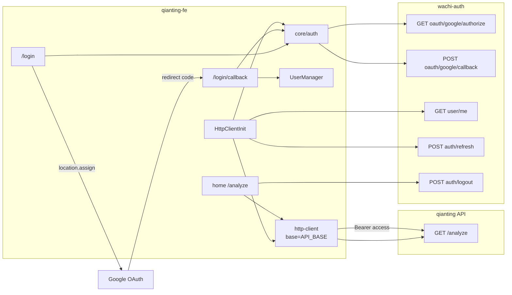

# Step 3 · 技术详细设计（Google 登录 → wachi-auth）

> 状态：**已实施**（Step 4 完成；联调待 wachi-auth 修复 2006）  
> 前置：[`02-requirements.md`](./02-requirements.md)  
> 范围：仅 **qianting-fe** 前端改造

---

## 0. 决策冻结（含产品补充）

| 决策 | 结论 |
|------|------|
| 认证服务 | `NEXT_PUBLIC_WACHI_AUTH_BASE` 默认 `https://auth.qianting.xyz` |
| App ID | `NEXT_PUBLIC_WACHI_AUTH_APP_ID` = `app_zHlN4VrsJHKhM77g` |
| 登录方式 | 仅 Google OAuth（Authorization Code + 整页跳转） |
| 回调路径 | 固定 `/login/callback`；绝对 URI = `origin + '/login/callback'` |
| 生产 redirect_uri | `https://qianting.xyz/login/callback`（产品声明已配；**前端默认按已通过处理**） |
| 当前 authorize `2006` | **不阻塞前端实施**；联调阶段在 **wachi-auth** 侧修复精确匹配/数据问题 |
| Token | access + refresh；localStorage；启动/失效时 refresh |
| Firebase | 完全移除 |
| 业务 JWT | 前端一律带 wachi-auth access；后端对齐为外部依赖 |
| 本地 localhost 白名单 | 建议运维加；前端仍用 `origin` 动态计算，未加则仅生产域名可走通 OAuth |

---

## 1. 架构总览



### 双 Base 原则

| 客户端 | Base | 路径前缀 | 用途 |
|--------|------|----------|------|
| 业务 http-client（现有） | `API_BASE` | `/analyze` 等 | 业务 |
| 认证请求 | `WACHI_AUTH_BASE` | `/api/v1/...` | OAuth / me / refresh / logout |

两者共享同一套 `getToken`（UserManager access_token），但 **URL host 不同**。

---

## 2. 模块与文件变更清单

| 路径 | 动作 | 说明 |
|------|------|------|
| `src/core/http-client/index.ts` | 改 | `HttpRequestConfig` 增加可选 `baseURL`，透传 axios，供认证请求覆盖 host |
| `src/core/auth/config.ts` | **新建** | `WACHI_AUTH_BASE`、`WACHI_AUTH_APP_ID`、`getOAuthRedirectUri()`、`sanitizeCallbackUrl()` |
| `src/core/auth/types.ts` | 改 | 替换为 wachi-auth VO；删除 Firebase `LoginReq` |
| `src/core/auth/api.ts` | 改 | authorize / callback / refresh / logout / me；全部带 `baseURL: WACHI_AUTH_BASE` |
| `src/core/auth/storage.ts` | 改 | 增删 `refresh_token`；扩展 save/clear/get |
| `src/core/auth/session.ts` | **新建** | OAuth 跳转前 `callbackUrl` 的 sessionStorage 读写 |
| `src/core/auth/index.ts` | 改 | 导出新 API / helpers；去掉 `authLogin` |
| `src/core/firebase.ts` | **删除** | — |
| `src/app/login/page.tsx` | 改 | 调 authorize → 整页跳转 |
| `src/app/login/callback/page.tsx` | **新建** | 换 code、落登录态、回跳 |
| `src/app/HttpClientInit.tsx` | 改 | 恢复双 token；me 失败则 refresh 再试 |
| `src/app/home/page.tsx` | 改 | logout 仍调 `authLogout`（实现已换 host） |
| `.env.example` | 改 | 去 Firebase，加 WACHI_* |
| `package.json` | 改 | 移除 `firebase` 依赖 |
| `docs/AUTH_API_FRONTEND.md` | 改 | 重写为 wachi-auth 对接 |
| `docs/TECH_ARCHITECTURE.md` / `AGENTS.md` | 改 | 认证描述更新 |
| `.cursor/rules/auth-and-user.mdc` | 改 | 登录链路更新 |
| `docs/wachi-auth-migration/03-tech-design.md` | 本文 | — |

**不改：** `UserManager` / `useUser` 对外形状（仍 token/name/avatar）；home 分析调用方式。

---

## 3. 配置设计（`core/auth/config.ts`）

```ts
export const WACHI_AUTH_BASE =
  process.env.NEXT_PUBLIC_WACHI_AUTH_BASE ?? "https://auth.qianting.xyz";

export const WACHI_AUTH_APP_ID =
  process.env.NEXT_PUBLIC_WACHI_AUTH_APP_ID ?? "";

export const OAUTH_CALLBACK_PATH = "/login/callback";

/** 与 authorize / callback 必须使用同一字符串 */
export function getOAuthRedirectUri(): string {
  if (typeof window === "undefined") return "";
  return `${window.location.origin}${OAUTH_CALLBACK_PATH}`;
}

/** 仅允许站内相对路径，防止开放重定向 */
export function sanitizeCallbackUrl(raw: string | null | undefined): string {
  if (!raw || !raw.startsWith("/") || raw.startsWith("//")) return "/";
  return raw;
}
```

- `WACHI_AUTH_APP_ID` 为空时：登录按钮点击直接报错「认证未配置」，不发起请求。
- **不在前端拼接或存储 Google Client Secret。**

---

## 4. HTTP 层扩展

### 4.1 `HttpRequestConfig.baseURL?`

```ts
// toAxiosConfig 增加：
baseURL: config.baseURL,
```

业务调用不传 `baseURL` → 仍用单例默认 `API_BASE`。  
认证调用显式传入 `baseURL: WACHI_AUTH_BASE`。

### 4.2 为何不新建第二套 http-client

- 复用现有 `Result<T>` / 拦截器 / Bearer 注入，避免双份解析逻辑。
- 认证与业务响应格式同为 `{ code, message, data }`，可共用 `toResultHttpResponse`。

### 4.3 认证路径常量

```ts
const AUTH_API = {
  authorize: "/api/v1/auth/oauth/google/authorize",
  callback: "/api/v1/auth/oauth/google/callback",
  refresh: "/api/v1/auth/refresh",
  logout: "/api/v1/auth/logout",
  me: "/api/v1/user/me",
} as const;
```

---

## 5. 类型设计（`core/auth/types.ts`）

```ts
/** OAuth callback / refresh 成功 data */
export interface TokenPairData {
  user_id: string;
  email: string | null;
  nickname: string | null;
  access_token: string;
  refresh_token: string;
  token_type: string;
  expires_in: number;
}

export interface OAuthAuthorizeData {
  provider: string;
  authorization_url: string;
}

export interface OAuthCallbackReq {
  app_id: string;
  code: string;
  redirect_uri: string;
}

export interface RefreshReq {
  refresh_token: string;
}

/** GET /user/me */
export interface AuthUser {
  user_id: string;
  app_id: string;
  email: string | null;
  email_verified?: boolean;
  nickname: string | null;
  avatar_url: string | null;
  status?: string;
  linked_providers?: string[];
}

export type MeResData = AuthUser;
export type LogoutResData = { message?: string };
```

删除：`LoginReq`、`LoginResData`（Firebase 形态）、旧 `AuthUser.uid/display_name/photo_url/provider`。

展示映射 helper（可放 `api.ts` 或 `storage.ts` 旁）：

```ts
export function displayFromAuthUser(u: Pick<AuthUser, "nickname" | "email" | "avatar_url">) {
  return {
    name: u.nickname ?? u.email ?? "",
    avatar: u.avatar_url ?? "",
  };
}

export function displayFromTokenPair(d: TokenPairData) {
  return {
    name: d.nickname ?? d.email ?? "",
    avatar: "", // callback 无头像时先空，随后 me 可补
  };
}
```

---

## 6. API 封装（`core/auth/api.ts`）

```ts
const authCfg = () => ({ baseURL: WACHI_AUTH_BASE });

export async function oauthAuthorize(redirectUri: string): Promise<Result<OAuthAuthorizeData>> {
  return get<OAuthAuthorizeData>(AUTH_API.authorize, {
    ...authCfg(),
    params: { app_id: WACHI_AUTH_APP_ID, redirect_uri: redirectUri },
  });
}

export async function oauthCallback(code: string, redirectUri: string): Promise<Result<TokenPairData>> {
  const body: OAuthCallbackReq = {
    app_id: WACHI_AUTH_APP_ID,
    code,
    redirect_uri: redirectUri,
  };
  return post<TokenPairData>(AUTH_API.callback, body, authCfg());
}

export async function authRefresh(refreshToken: string): Promise<Result<TokenPairData>> {
  return post<TokenPairData>(AUTH_API.refresh, { refresh_token: refreshToken }, authCfg());
}

export async function authLogout(): Promise<Result<LogoutResData>> {
  return post<LogoutResData>(AUTH_API.logout, {}, authCfg());
}

export async function authMe(): Promise<Result<MeResData>> {
  return get<MeResData>(AUTH_API.me, authCfg());
}
```

- **删除** `authLogin(idToken)`。
- home / 其它调用方继续 `authLogout` / `authMe` 导出名，降低改动面。

---

## 7. 存储设计

### 7.1 localStorage（`storage.ts`）

| Key | 操作 |
|-----|------|
| `access_token` | 沿用 |
| `refresh_token` | **新增** |
| `user_name` / `user_avatar` | 沿用 |

```ts
saveAuthToStorage(access, refresh, name, avatar)
clearAuthFromStorage()           // 四键全清
getStoredToken()                 // access
getStoredRefreshToken()          // refresh
getStoredUser()                  // { name, avatar } | null（仍要求有 access）
```

签名变更：所有 `saveAuthToStorage` 调用点同步改三/四参数。

### 7.2 sessionStorage（`session.ts`）

| Key | 用途 |
|-----|------|
| `oauth_callback_url` | OAuth 往返期间暂存站内回跳 |

```ts
setPendingCallbackUrl(url: string)
consumePendingCallbackUrl(): string  // 读出并删除，默认 "/"
```

---

## 8. 时序设计

### 8.1 登录

```
User          LoginPage       wachi-auth       Google        CallbackPage
 |               |                |              |               |
 | click Google  |                |              |               |
 |-------------->|                |              |               |
 |               | setPendingCallbackUrl         |               |
 |               | oauthAuthorize |              |               |
 |               |--------------->|              |               |
 |               | authorization_url             |               |
 |               | location.assign ------------->|               |
 |               |                |   authorize  |               |
 |               |                |              | redirect code |
 |               |                |              |-------------->|
 |               |                | oauthCallback|               |
 |               |                |<-------------|               |
 |               |                | token pair   |               |
 |               |                |------------->|               |
 |               |                |              | save + login  |
 |               |                |              | consume url   |
 |               |                |              | replace(home) |
```

### 8.2 启动恢复 + refresh

```
HttpClientInit
  restore access(+refresh) → UserManager.setUser
  initHttpClient({ getToken })
  if !access: return
  res = authMe()
  if ok: update name/avatar, save
  else if isAuthExpired(res) && refresh:
      r = authRefresh(refresh)
      if r.ok: save 新双 token, UserManager.login, authMe 再刷资料
      else: clear + logout
  else: clear + logout
```

`isAuthExpired`：`errorCode === 1007 || errorCode === 401`。

> 本期不做「业务请求 401 全局自动 refresh 重试」拦截器，避免复杂度；启动恢复 + 用户重新登录覆盖主路径。若后续需要可再加单飞 refresh 队列。

---

## 9. 页面改造要点

### 9.1 `/login`（`login/page.tsx`）

```ts
async function handleGoogleLogin() {
  if (!WACHI_AUTH_APP_ID) { setError("认证未配置"); return; }
  setLoading(true);
  try {
    const redirectUri = getOAuthRedirectUri();
    setPendingCallbackUrl(sanitizeCallbackUrl(callbackUrl));
    const res = await oauthAuthorize(redirectUri);
    if (!res.ok) {
      setError(mapAuthError(res)); // 2006/2007 等可读文案
      return;
    }
    window.location.assign(res.data.authorization_url);
  } catch (e) {
    setError(...);
  } finally {
    setLoading(false); // 若已 assign 可能来不及，无妨
  }
}
```

移除所有 `signInWithGoogle` / `getIdToken` / `authLogin`。

### 9.2 `/login/callback`（新建）

- `"use client"` + `Suspense`（读 `useSearchParams`）。
- `useEffect` 单次执行换票（用 ref 防 Strict Mode 双调；或依赖 `code`）。
- 无 `code`：展示错误 + Link 回 `/login`。
- 成功：`saveAuthToStorage` + `UserManager.login`；可选再 `authMe` 补 avatar；`router.replace(consumePendingCallbackUrl())`。
- UI：沿用登录页简洁风格（居中文案「登录处理中…」/ 错误态），不做视觉大改。

### 9.3 `HttpClientInit`

按 §8.2；同步帧仍 `initHttpClient`；异步恢复放 `useEffect`。

### 9.4 `home` 登出

保持：

```ts
await authLogout(); // 现已打 wachi-auth
finally { clearAuthFromStorage(); getUserManager().logout(); ... }
```

确保 `clearAuthFromStorage` 清 refresh。

---

## 10. 错误文案映射（建议）

| code | 文案 |
|------|------|
| 2006 | 登录回调地址未授权，请稍后重试或联系管理员 |
| 2007 | Google 登录暂不可用 |
| 1008 | 第三方登录失败，请重试 |
| 1007 / 401 | 登录已失效，请重新登录 |
| 2001 | 应用配置异常 |
| 其它 | `errorMessage` 或「登录失败，请重试」 |

`2006`：前端按上表提示即可；**根因修复归属 wachi-auth 联调**（本设计不在前端做 URI 模糊匹配或绕过）。

---

## 11. 环境变量与依赖

### `.env.example`

```env
NEXT_PUBLIC_WACHI_AUTH_BASE=https://auth.qianting.xyz
NEXT_PUBLIC_WACHI_AUTH_APP_ID=app_zHlN4VrsJHKhM77g

# Optional: business API base
# NEXT_PUBLIC_API_BASE=https://api.qianting.xyz
```

### 依赖

```bash
npm uninstall firebase
```

---

## 12. 文档与规则同步（实施时一并改）

- `docs/AUTH_API_FRONTEND.md`：改为 wachi-auth OAuth + 双 Base + 双 token。
- `docs/TECH_ARCHITECTURE.md` / `AGENTS.md`：删除 Firebase，改为 wachi-auth。
- `.cursor/rules/auth-and-user.mdc`：登录链路改为 authorize → callback → storage。
- 旧文中 sessionStorage 存 token 的表述统一为 **localStorage**（与代码一致）。

---

## 13. 实施顺序（Step 4 执行清单）

1. 扩展 `http-client` 支持 per-request `baseURL`
2. 新增 `config.ts` / `session.ts`；改 `types` / `storage` / `api` / `index`
3. 改 `HttpClientInit`（恢复 + refresh）
4. 改 `login/page.tsx`；新增 `login/callback/page.tsx`
5. 确认 home logout 兼容；删 `firebase.ts`；`npm uninstall firebase`
6. 更新 `.env.example` 与文档/rules
7. `npm run lint` / `npm run build` 冒烟

---

## 14. 测试与联调注意

| 项 | 说明 |
|----|------|
| 前端单测 | 本期不强制；以手工 T1–T9（见需求文档）为主 |
| authorize `2006` | 预期在 wachi-auth 修复后消失；前端已有错误展示 |
| redirect_uri | 前后端联调时两边打印实际字符串，确认无空格/尾斜杠差异 |
| Google Console | 须含同一回调 URI，否则停在 Google 侧 |
| 业务 401 | 若登录成功但 analyze 401 → 查 qianting 后端 JWT 校验，非前端 token 存储问题 |

---

## 15. 风险与非目标回顾

- **不做**业务 axios 401 自动 refresh 重试（可后续迭代）。
- **不做**邮箱/Apple。
- **不在本仓库修** wachi-auth `2006`。
- UserManager 不强制持有 refresh（refresh 以 localStorage 为源），避免扩大 user 模块 API。

---

## 16. 请确认

1. 双 Base 方案（业务单例 + 请求级 `baseURL` 覆盖）是否同意？  
2. 启动时 me → refresh → 再 me；**不做**全局 401 拦截自动续期 —— 是否同意？  
3. 回调成功后若无 avatar，先空头像，是否接受（或强制 callback 后再拉一次 me）？  
4. 其余按本文实施是否 OK？

确认后进入 **Step 4 · 代码实施**。
